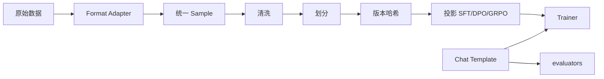

# PostTrainLab

统一的大模型后训练实验平台：SFT → DPO/IPO → GRPO，配合 Hydra 分层配置与消融实验调度。

## 架构

```
PostTrainLab/
├── configs/          # Hydra 分层配置（model / data / training / eval / experiment）
├── src/
│   ├── core/         # 统一基类与接口
│   ├── data/         # 统一 Sample 流水线：适配器/清洗/划分/版本/Chat Template
│   ├── models/       # 模型加载、LoRA
│   ├── algorithms/   # 自研 DPO/IPO Loss、GRPO 奖励引擎
│   ├── trainers/     # SFT / DPO / GRPO 训练器
│   ├── evaluators/   # 任务评测与报告
│   ├── experiment/   # 消融调度与追踪
│   └── utils/        # 通用工具
├── scripts/          # 一键训练 / 评测 / 消融
├── tests/            # 单元测试（含 DPO Loss 正确性）
├── benchmarks/       # 评测数据集
└── outputs/          # checkpoints / logs / wandb
```



## 数据流水线

一份原始数据经统一 `Sample` 后可投影到任意算法：

```bash
# 同一 gsm8k 数据 → GRPO
python scripts/train.py training=grpo data=gsm8k

# 偏好数据 → DPO
python scripts/train.py training=dpo data=dpo_demo

# 启用敏感词过滤 / 自定义划分
python scripts/train.py data.cleaning.filter_sensitive=true data.split.ratios=[0.8,0.1,0.1]
```

数据版本写入 `outputs/data_versions/<name>/<version>/dataset_version.json`，
同目录下有 `latest.json` 指针；并写入本次实验的 `cfg.data_version`。

复现实验时可强制校验：

```bash
python scripts/train.py data.expected_version=v-toy data.expected_hash=abc123def456
```

## 快速开始

### 环境

```bash
# 本地
pip install -e ".[dev]"

# 外部服务器（推荐）
bash scripts/setup_server.sh
source .venv/bin/activate
# 编辑 .env，填入 WANDB_API_KEY（从 https://wandb.ai/authorize 复制）
# 之后一般不必再执行 wandb login

# 或 Docker
docker build -t posttrainlab .
docker run --gpus all -it -v $(pwd)/outputs:/workspace/outputs posttrainlab
```

`.env.example` 可复制为 `.env`；进程启动时会自动加载（密钥勿提交 git）。

### 训练

日志、W&B、断点续训、分布式，以及梯度累积、混合精度、梯度检查点、随机种子和学习率调度都由 `BaseTrainer` 统一处理。SFT / DPO / GRPO / PPO 只实现算法。各算法 yaml 里的学习率、累积步数、调度器仍然生效；要全局覆盖时用 `engineering.*=...`。

#### SFT 基线（TRL + Full/LoRA 对比）

基于 `trl.SFTTrainer`；同一权重 `Qwen2.5-0.5B-Instruct`，用两套预设切换微调方式。自研：`sampler`（随机 / 长度分组 / 分桶）与 `grad_clip`（norm / value / adaptive）。

```bash
# LoRA
python scripts/train.py training=sft model=qwen2.5-0.5b data=gsm8k training.max_steps=20

# Full（对照）
python scripts/train.py training=sft model=qwen2.5-0.5b-full data=gsm8k training.max_steps=20

# 切换采样 / 裁剪策略
python scripts/train.py training=sft model=qwen2.5-0.5b \
  training.sampler.mode=bucket training.grad_clip.strategy=norm
```

```bash
python scripts/train.py training=sft data=gsm8k
python scripts/train.py training=dpo data=dpo_demo
python scripts/train.py training=grpo data=gsm8k

# 开启 WandB
python scripts/train.py training=dpo wandb=online
python scripts/train.py training=grpo wandb=offline

# 从最新 checkpoint 接着训
python scripts/train.py training=sft engineering.resume_from_checkpoint=true

# 多卡
torchrun --nproc_per_node=2 scripts/train.py training=grpo data=gsm8k
```

### 日志与产物

- Hydra 每次运行目录：`outputs/logs/{algorithm}/{timestamp}/`
  - `run.log` — 控制台同级文件日志
  - `resolved_config.yaml` — 解析后的完整配置
- W&B 本地目录：`outputs/wandb/`（由 `configs/wandb/*.yaml` 控制）

```bash
# 覆盖日志级别
python scripts/train.py logging.level=DEBUG

# 自定义 run 名 / 项目
python scripts/train.py wandb=online wandb.project=my-ptl run_name=dpo-beta01
```

### 评测

```bash
python scripts/eval.py eval=gsm8k model=qwen2.5-0.5b
```

### 消融实验

```bash
python scripts/ablation.py experiment=ablation
```

## 核心算法亮点

| 模块 | 说明 |
|------|------|
| `algorithms/dpo_loss.py` | 自研 DPO / IPO Loss，支持动态 β 与额外惩罚项 |
| `algorithms/reward_functions.py` | GRPO 可插拔奖励函数引擎（准确率 / 格式 / 组合） |
| `algorithms/grpo_loss.py` + `grpo_engine.py` | 自研 GRPO：组内优势、PPO-clip、参考 KL |
| `trainers/ppo_trainer.py` | 基于 TRL `PPOTrainer` 的基线，仅用于和 GRPO 对比 |


## 实验结果

训练与评测产物统一写入 `outputs/`：

- `outputs/checkpoints/` — 模型权重
- `outputs/logs/` — 训练日志
- `outputs/wandb/` — W&B 本地缓存

（具体数值表在完成首轮实验后回填至此。）
