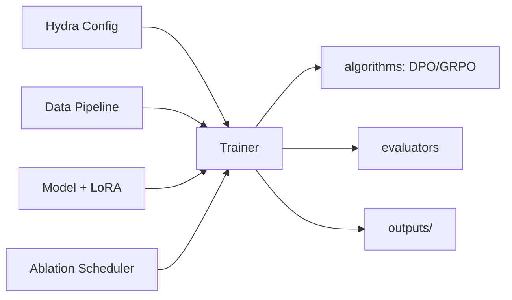

# PostTrainLab

统一的大模型后训练实验平台：SFT → DPO/IPO → GRPO，配合 Hydra 分层配置与消融实验调度。

## 架构

```
PostTrainLab/
├── configs/          # Hydra 分层配置（model / data / training / eval / experiment）
├── src/
│   ├── core/         # 统一基类与接口
│   ├── data/         # 数据加载、清洗、采样、模板
│   ├── models/       # 模型加载、LoRA
│   ├── algorithms/   # 自研 DPO/IPO Loss、GRPO 奖励引擎
│   ├── trainers/     # SFT / DPO / GRPO 训练器
│   ├── evaluators/   # 任务评测与报告
│   ├── experiment/   # 消融调度与追踪
│   └── utils/        # 通用工具
├── scripts/          # 一键训练 / 评测 / 消融
├── tests/            # 单元测试（含 DPO Loss 正确性）
├── benchmarks/       # 评测数据集
└── outputs/          # checkpoints / logs / wandb
```



## 快速开始

### 环境

```bash
# 本地
pip install -e ".[dev]"

# 或 Docker
docker build -t posttrainlab .
docker run --gpus all -it -v $(pwd)/outputs:/workspace/outputs posttrainlab
```

### 训练

```bash
# SFT
python scripts/train.py training=sft data=gsm8k model=qwen2.5-7b

# DPO
python scripts/train.py training=dpo model=qwen2.5-7b

# GRPO
python scripts/train.py training=grpo data=gsm8k model=qwen2.5-7b
```

### 评测

```bash
python scripts/eval.py eval=gsm8k model=qwen2.5-7b
```

### 消融实验

```bash
python scripts/ablation.py experiment=ablation
```

## 核心算法亮点

| 模块 | 说明 |
|------|------|
| `algorithms/dpo_loss.py` | 自研 DPO / IPO Loss，支持动态 β 与额外惩罚项 |
| `algorithms/reward_functions.py` | GRPO 可插拔奖励函数引擎（准确率 / 格式 / 组合） |
| `algorithms/grpo_utils.py` | GRPO 组内相对优势与采样辅助 |

## 实验结果

训练与评测产物统一写入 `outputs/`：

- `outputs/checkpoints/` — 模型权重
- `outputs/logs/` — 训练日志
- `outputs/wandb/` — W&B 本地缓存

（具体数值表在完成首轮实验后回填至此。）
